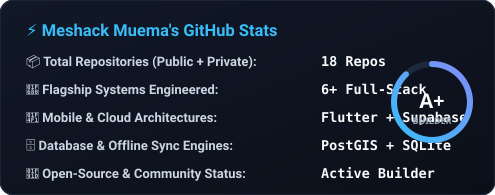
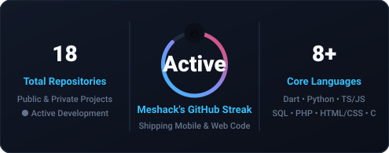
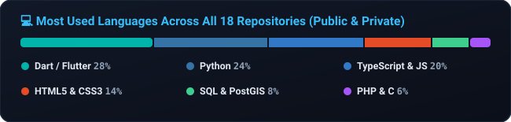

<!-- ===================================================================== -->
<!--                    MESHACK MUEMA (meekshey254)                        -->
<!--                   MODERN GITHUB PROFILE README                        -->
<!-- ===================================================================== -->

  <!-- Custom Self-Hosted Animated SVG Hero Banner (100% Uptime) -->
  

    

  <!-- Quick Navigation Links -->
  

    <a href="#-about-me"><b>🧑‍💻 About Me</b></a> •
    <a href="#-tech-stack--tools"><b>🛠️ Tech Stack</b></a> •
    <a href="#-featured-projects--repositories"><b>🚀 Projects (18 Repos)</b></a> •
    <a href="#-github-analytics--streak"><b>📊 GitHub Streak &amp; Stats</b></a> •
    <a href="#-lets-connect--collaborate"><b>🌐 Let's Connect</b></a>
  

  <!-- Live Status & Profile Badges -->
  

    
    
    
  

---

## 🧑‍💻 About Me

I'm **Meshack Muema** (**Meek**), a passionate Full-Stack & Mobile Software Developer who loves turning real-world operational challenges into fast, reliable mobile and web systems.

- 🔭 **Flagship Engineering:** Building **Jennifer and Clara Academy (`jennifer-clara-academy`)** — a single-app **6-role Flutter Android & Desktop ecosystem** backed by **Supabase (PostgreSQL + PostGIS + Realtime)** and an **offline-first SQLite sync engine**.
- 🧩 **Versatile Builder:** Across my **18 public and private repositories**, I've built healthcare clinic systems, smart e-reception portals, M-Pesa statement parsers, e-commerce catalogs, fitness booking platforms, and C systems utilities.
- 🌱 **Core Focus Areas:** Cross-platform **Flutter/Dart**, **Python (Django, Automation & NLP)**, **TypeScript/JavaScript (React & Node.js)**, and geospatial/cloud databases (**PostGIS, PostgreSQL, SQLite**).
- ⚡ **Engineering Philosophy:** Build software that works seamlessly both in the cloud and offline in the field.

 

---

## 🛠️ Tech Stack & Tools

| Category | Technologies & Frameworks |
| :--- | :--- |
| **📱 Mobile & Cross-Platform** |    |
| **🌐 Frontend & Web** |      |
| **⚙️ Backend & Systems** |      |
| **🗄️ Databases & Geospatial** |      |
| **🧰 Dev Tools & Workflow** |    |

---

## 🚀 Featured Projects & Repositories

Here is a snapshot of the systems and applications across my GitHub repositories:

| Repository / Project | Stack | What It Entails |
| :--- | :--- | :--- |
| **🏫 `jennifer-clara-academy`** | `Flutter` `Dart` `Supabase` `PostGIS` `SQLite` | **School Management & Live Van Tracking App** — Single-app **6-role ecosystem** featuring live GPS van tracking, PostGIS geofence alerts (`500m`/`80m`/`150m`), multi-child fee ledgers, and auto-ranked PDF report cards. |
| **🤖 `Intelligent-e-reception`** | `TypeScript` `Web` | **Smart E-Reception System** — Digital front-desk platform for automated visitor check-in, host notifications, and reception workflow management. |
| **🏥 `Clinic`** | `JavaScript` `HTML/CSS` | **Healthcare & Clinic Management** — Web application streamlining patient registration, appointment scheduling, and clinical record tracking. |
| **💳 `Mpesa_Statement`** | `Python` | **M-Pesa Financial Statement Parser** — Python utility that extracts, cleans, and analyzes mobile money transaction statements for financial reporting. |
| **🏗️ `ujenzi`** | `HTML5` `CSS3` `JavaScript` | **Ujenzi Materials Web Platform** — Custom-redesigned digital storefront and construction materials catalog for `ujenzimaterials.co.ke`. |
| **💪 [`fitness`](https://github.com/meekshey254/fitness)** | `HTML5` `CSS3` `JS` `PHP` `MySQL` | **Fitness & Wellness Portal** — Full-stack fitness club website with member authentication (`Auth.php`), class booking (`FitnessClass.php`), mentor profiles, and SQL schema. |
| **📝 [`notetaker`](https://github.com/meekshey254/notetaker)** | `Python` `HTML` | **Dual CLI & Web Note-Taker** — Lightweight productivity app with both a Python CLI (`notetaker.py`) and a web interface (`notetaker_web.py`) for instant note capture. |

<b>📂 Explore More Repositories in My Portfolio (Click to Expand All 18 Projects)</b>

 

| Repository | Tech Stack | Project Summary |
| :--- | :--- | :--- |
| **⛺ `MasenoCampEv`** | `PHP` `MySQL` | Event registration, scheduling, and community management portal built for Maseno Camp events. |
| **🏛️ `PSCMS`** | `Web / CMS` | Structured Content & Project Management System for organizational workflows and record keeping. |
| **💼 `DollaConcept`** | `JavaScript` `HTML/CSS` | Interactive digital business and brand showcase web application. |
| **🔎 `searchbot`** | `Python` | Automated search and information retrieval bot for fast query indexing. |
| **🐍 `m4hg`** | `Python` | Python automation and data processing scripts. |
| **✨ `Nexus`** | `HTML5` `CSS3` | Modern responsive web interface and landing layout experiment. |
| **🏠 `housing`** | `C` | Systems-level housing and unit allocation management program written in C. |
| **🧮 `Calculator`** | `C` | Fast command-line mathematical and scientific calculator built in C. |
| **🌐 `portfolio` & `Cv`** | `HTML5` `CSS3` | Personal developer portfolio showcase and interactive web-based Curriculum Vitae. |

<b>🔍 Deep Dive: Jennifer &amp; Clara Academy (6-Role Flutter Architecture)</b>

 

Built with **Flutter**, **Supabase (PostgreSQL + PostGIS + Realtime)**, and an **offline-first SQLite cache**:

| Role Portal | Key Capabilities |
| :--- | :--- |
| **👨‍👩‍👧 Parent Portal** | Multi-child switcher (`Combined Family Balance` vs. `Selected Child` itemized Tuition, Transport, Activity & Remedial fees), live **School Van 01** tracking, 1-tap absence reporting, Guardian Pickup PIN, and printable PDF Report Cards. |
| **🚐 Van Driver Console** | Shared route stop progression, live GPS telemetry, `500m Approaching` / `80m Arrived` / `150m School` PostGIS triggers, 1-tap `Boarded`/`Dropped Off` actions, and mandatory **"No Child Left Behind"** post-trip cabin verification. |
| **👩‍🏫 Class Teacher Dashboard** | Daily classroom roll-call, exam mark entry with **Subject Teacher Remarks**, 1-click **Auto-Ranking Leaderboard**, and contextualized 1-to-1 parent messaging. |
| **🧾 Headteacher & Secretary** | Itemized fee collection (`Auto-Allocate`, `Tuition`, `Transport`, `Activity`, `Remedial`), instant receipts, deduplicated parent broadcasts, and **Early Pickup Gate Passes** synced with the van manifest. |
| **👔 School Director Dashboard** | Executive fee collection analytics and targeted staff communications (All Teachers, All Staff, or custom multi-select staff briefings). |
| **⚙️ Admin & School Setup** | Dynamic school branding, class-level remedial fee toggles (`has_remedials`), staff pre-registration, and student-to-van-stop enrollment. |

---

## 📊 GitHub Analytics & Streak

  
  

 

  

---

## 🌐 Let's Connect & Collaborate

  
Whether you're looking to collaborate on a <b>Flutter mobile app</b>, build a <b>full-stack Python/TypeScript platform</b>, or chat about open-source technology—my inbox is always open!

| Channel | Handle / Coordinate | Best For | Direct Action |
| :--- | :--- | :--- | :---: |
| **📧 Email** | `meshmuema11@gmail.com` | Project inquiries, engineering roles & formal collaboration |  |
| **💼 LinkedIn** | **Meshack Muema** | Professional networking, career updates & endorsements |  |
| **💬 WhatsApp** | `+254 743 886777` | Quick real-time chats, consultations & project syncs |  |
| **🐙 GitHub** | `@meekshey254` | Open-source code, issue discussions & pull requests |  |

 

  

